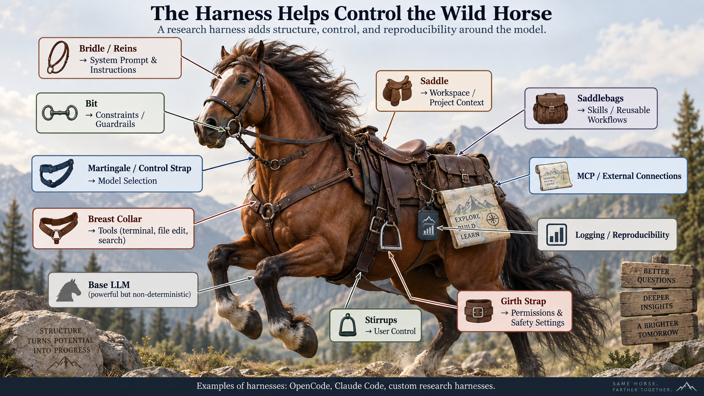
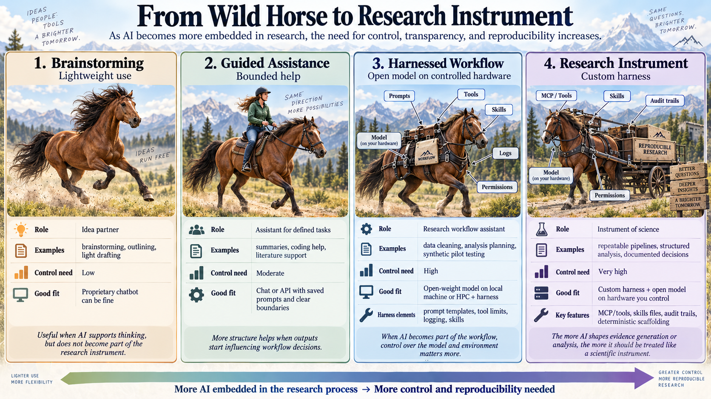

# **From General-Purpose Agents to Reproducible Scientific Workflows** {#from-general-purpose-agents-to-reproducible-scientific-workflows}

Large language models are a little like **wild horses that need to be harnessed**.

The original chatbot interface was an early type of harness: it provided a controlled environment through which people could interact with an LLM. The LLM was “wrapped” in a chatbot interface, creating two components that were influencing the output: the model itself, and the UI.  Tools such as Claude Code, OpenAI Codex, and OpenCode take the harness concept considerably further. These tools wrap around LLM models (but do not change the model), offering a number of features to both the user and the LLM that expand the potential outputs and the quality of those outputs. One advantage of these tools (“harnesses”) is that they manage multiple LLMs working independently or together on a task (i.e., they can create and utilize “agents”). 

The lines between LLMs and their harnesses is further blurred now that the agentic systems (e.g., Claude Code) are integrated in the web based chatbots (e.g., Claude). This offers many valuable opportunities for users outside of research contexts, but also adds many layers of complexity about if and how these proprietary tools should be used at different points in a research project. There are related considerations when using open source harnesses with locally hosted open weights models (or open source harnesses with API access to proprietary models), and each of these choices will require considerations related to data and reproducibility.

A useful way to think about a harness in research is as the set of **controls placed around an otherwise nondeterministic model**. If you simply use a chatbot or open weights model in Ollama, you are largely riding the model “bareback”: you can give instructions, but you have limited control over the surrounding process. A harness adds reins, stirrups, and a saddle. It can constrain, for example, what information the model receives, what tools it can use, how outputs are structured, what gets logged, which steps are deterministic, when a human must review a result, and what happens when something fails.

This matters because LLMs are inherently nondeterministic. We may not be able to make the model itself fully deterministic, but we can surround it with increasingly deterministic procedures. Schemas, validation rules, fixed preprocessing, versioned prompts, automated tests, logging, human-review checkpoints, and reproducible execution environments all reduce the number of uncontrolled degrees of freedom in the overall research workflow. In that sense, the purpose of the harness is not to eliminate model variability, but to **bound it, observe it, and make its role in the research process more consistent and reproducible**.

[](assets/harnesses-image1-large.png){target="_blank" rel="noopener"}

*Image generated with OpenAI Codex.*

The model provides underlying reasoning and language capabilities. The **harness determines what the model can actually do, and what boundaries are established for controlling those actions**.

A harness may give an LLM access to:

* files and directories;  
* command-line tools;  
* Python, R, or other analytical software;  
* web search and websites;  
* Git repositories;  
* external services through MCP;  
* reusable `SKILL.md` files;  
* persistent project instructions;  
* subagents;  
* tests and validation tools;  
* permissions governing which tools the model may use.

As models become more similar in capability, the harness can become an increasingly important source of difference between AI systems.

**The more nondeterministic the instrument, the more valuable deterministic controls around the instrument become**

For research, however, the goal is not simply to choose the most capable harness.

The more important question is:

> **What kind of AI-enabled workflow is appropriate for this research question, this methodological role, and the expectations of this discipline?**

Not every use of an LLM requires the same degree of control. If the model is helping brainstorm research questions, improve prose, or troubleshoot a piece of code, a proprietary chatbot may be entirely reasonable: the LLM is assisting the researcher, but it is not itself a consequential part of the scientific instrument. As the LLM becomes more deeply embedded in the methods—coding data, generating simulations, interacting with participants, selecting cases, transforming data, or producing analyses—the requirements change. The model, harness, tools, prompts, and computational environment increasingly become components of the research method. At that point, researchers have stronger reasons to move toward an inspectable harness, open-weight models, and computing environments they can control and characterize, such as a local workstation or institutional HPC.

Put differently, the amount of control we need should rise with the methodological consequence of the LLM's output. We do not need laboratory-grade instrumentation to brainstorm an idea. But when AI becomes part of the instrument producing the evidence, control over that instrument becomes part of scientific rigor.

[](assets/harnesses-image2-large.png){target="_blank" rel="noopener"}

*Image generated with OpenAI Codex.*

# Why Read/Use This {#why-read-use-this}

The goal of this document is to provide guidance for using an open source harness  along with open weights LLM’s in your research tasks.  This is an “open science” focused alternative to using Claude Code, OpenAI Codex, and other similar (i.e., blackbox harness \+ blackbox model) proprietary tools where you don’t really know what skills agents are using, the code that drives the tools they utilize, or even which model version your prompts are being routed to after they leave your computer. For some scientific tasks, the hardware on which the models run might also have subtle influences on the results you get. 

I have selected OpenCode as my open source harness since it seems (based on my informal assessment) to be the best option as of today, and likewise I selected Ollama for managing open weights models since it balances ease of use and versatility.  You could easily apply the same guidance to other harness tools and model managers.

The set-ups I’m documenting are for when you want your research to be reproducible. I still use Codex and other blackbox tools for general brainstorming and software development, but when that work moves into my research then I’m making an effort to utilize tools that are transparent and support reproduction. The open source tools and open weights models are converging on the performance benchmarks of the proprietary frontier models – I’m confident that you will be pleasantly surprised by the quality of results you can get.

---

# **1\. Start With the Research, Not the AI Tool** {#section-1--start-with-the-research--not-the-ai-tool}

Once the research question and intended role of the LLM are clear, the next question is what **research controls** are needed around it. The more consequential the LLM is to the production of findings, the less appropriate it is to rely on an unconstrained chatbot interaction. Instead, researchers can progressively add controls through the harness: fixed context, structured outputs, deterministic preprocessing and validation, explicit tools, permissions, logging, tests, and human review. The harness therefore becomes part of the methodological design rather than merely the interface used to access the model.

The appropriate use of an LLM should begin with the **research question and methods**, not with a particular model or product.

A useful sequence is:

```text
Research question
       v
Research task
       v
Role for the LLM
       v
Required context
       v
Appropriate harness
       v
Model + computing environment
       v
Evaluation and human oversight
       v
Scale and reuse
```

Researchers should first ask:

* What am I trying to accomplish?  
* Why is an LLM useful for this particular task?  
* What role should it play?  
* How much human agency should remain in the workflow?  
* How much could the LLM affect the eventual findings?  
* What would constitute an acceptable failure rate?  
* Which decisions require human review?  
* What degree of reproducibility is expected in my field?

The answer will not necessarily be the same across disciplines.

A computational social scientist, qualitative researcher, molecular biologist, historian, and clinical researcher may have very different traditions regarding reproduction, verification, transparency, computational methods, and acceptable researcher judgment.

Those disciplinary norms are still emerging for LLM-enabled research.

The fact that there may not yet be a settled standard does not mean researchers should wait for one. Through their own practices, researchers are already helping establish the **norms that may eventually become disciplinary conventions and formal standards**.

---

## 1.1 Considering LLMs in Your Research? {#section-1-1-considering-llms-in-your-research}

[Updated version available here](considering-llms.html).

---

## 1.2 Reproducibility as a Design Goal {#section-1-2-reproducibility-as-a-design-goal}

LLMs introduce a special challenge because they are **inferential and nondeterministic instruments**.

A traditional computational function generally performs specified operations on inputs. An LLM may instead produce different outputs as a consequence of:

* model weights;  
* prompts;  
* context;  
* runtime environment;  
* model routing;  
* inference parameters;  
* tool availability;  
* conversation history;  
* agent branching;  
* the hardware the model runs on; and  
* interactions among these components.

In addition, if you are using proprietary LLMs (e.g., OpenAI's GPT models, Anthropic’s Claude models) there may be multiple iterations of the model to improve performance. These “snapshots” are often noted by the date (e.g., gpt-4o-2024-08-06) or versions (e.g., claude-sonnet-4-6), and can only be specified when prompting through API calls. In other words, if you go through the web interface you will not know which (or which combination) specific model, defined by its weights matrix, produced your outputs. Thus, even for “guided assistance” in your research, if you are using proprietary models then accessing specific instances through API requests is important for documenting your research and for possible reproduction later. Do note, however, that proprietary models are routinely deprecated and this can limit the lifespan for possible reproduction (e.g., claude-sonnet-4-20250514 was deprecated just a year after it was released), whereas open weights models can be downloaded and stored for later use.

Reproducibility with LLMs does not generally mean obtaining the **identical sequence of tokens**.

A more useful objective is often:

> Provide enough methodological control and transparency that another researcher can understand, evaluate, reproduce where feasible, or systematically test the workflow and its results.

The appropriate level of control should be **proportional to the methodological role of the LLM and its potential impact on the research findings**.

Or that is to say:

> **The required level of harness control should rise with the methodological consequences of AI use.**

---

# **2\. A Continuum of Harness Choices** {#section-2--a-continuum-of-harness-choices}

Researchers can think of harnesses along a continuum.

|  | Claude Code, OpenAI Codex, etc. | OpenCode, or similar open harnesses | Custom science harness |
| ----- | ----- | ----- | ----- |
| **Reproducibility potential** | **Lower** | **Medium–High** | **High** |
| Transparency | Lower | Higher | Highest |
| Open-weight model support | Varies | Yes (local or via API) | Yes (local or via API) |
| Proprietary models | Yes | Yes, via API | Yes, via API |
| Technical skill required | Low | Medium | High |
| GPU access | Vendor, local where supported | Local, HPC, or API | Local, HPC, or API |
| Workflow customization | Medium | High | Very high |
| Control over tools | Limited | High | Very high |
| Control over logging | Medium | High | Very high |
| Control over human review points | Medium | High | Very high |
| Institutional infrastructure | Limited | Possible | Possible |

The continuum involves a tradeoff:

| More convenience |  |  |  |                          More explicit control  |
| :---: | ----- | :---: | :---: | ----- |
| **Claude/Codex** | **→** | **OpenCode** | **→** | **Custom research harness** |

A researcher doing exploratory coding may reasonably choose Claude Code.

A laboratory developing a repeatable research procedure may prefer OpenCode with reusable skills.

A research team whose LLM workflow directly produces study findings may decide to encode the process in explicit Python scripts.

---

## 2.1. Why OpenCode Is an Interesting Middle Ground {#section-2-1--why-opencode-is-an-interesting-middle-ground}

OpenCode provides many of the agent capabilities associated with commercial systems such as Claude Code and Codex while allowing researchers to choose the model and computing infrastructure.

| Capability | OpenCode | Claude Code / Codex comparison |
| ----- | :---: | :---: |
| Read/write/edit entire repository | ✅ | Core feature |
| Run shell commands | ✅ | ✅ |
| Run tests/builds and fix failures | ✅ | ✅ |
| Git operations | ✅ via shell | ✅ |
| Plan before implementing | ✅ | ✅ |
| Autonomous multi-step work | ✅ | ✅ |
| Subagents | ✅ | ✅ |
| Custom agents | ✅ | ✅ |
| Web search | ✅ | ✅ |
| Fetch/read webpages | ✅ | ✅ |
| MCP servers | ✅ | ✅ |
| Reusable `SKILL.md` skills | ✅ | ✅ |
| Persistent project instructions | ✅ `AGENTS.md` | Similar mechanisms |
| Tool permissions/approvals | ✅ | ✅ |
| Custom tools | ✅ | ✅ |
| LSP/code intelligence | ✅ | Similar |
| Todo/task tracking | ✅ | ✅ |
| Different models per agent | ✅ | Varies |
| Local/open-weight inference | **✅ Major advantage** | Not the normal commercial workflow |

This means the harness can remain relatively sophisticated while the researcher controls:

```text
OpenCode
   |
   +-- model
   +-- tools
   +-- skills
   +-- project instructions
   +-- permissions
   +-- web access
   +-- MCP servers
   +-- computing environment
```

For many researchers, this may provide a useful compromise between an opaque commercial agent and building an entire scientific workflow from scratch.

## 2.3 Comparative Logging Capabilities

| Feature | OpenCode | Proprietary Platforms (Claude, Codex/OpenAI) |
| ----- | ----- | ----- |
| **Comprehensive Input/Output Archiving** | **Complete local logging**. Every raw token, hidden prompt, systemic instruction, and multi-agent back-and-forth is captured in plaintext or JSON files. | **Restricted or siloed**. Interaction history is stored behind cloud accounts, can be modified/deleted by the provider, and frequently hides systemic system prompts. |
| **MCP & Tool Call Auditing** | **Granular logging** of which Model Context Protocol (MCP) server was hit, what parameters were sent, and the exact tool output received. | **Black-box integration**. Internal tool calls (like advanced data analysis or browsing) lack raw parameter logging and full execution traces. |
| **Model Version Determinism** | **Total control**. If you hook up local open-weights models (via Ollama/vLLM), the architecture, weights, and hyper-parameters remain completely static for replication. | **Dynamic version shift**. APIs are subject to rolling updates, deprecations, and backend fine-tuning, meaning a prompt run today may yield different results in 6 months. |
| **Data Privacy & IRB Compliance** | **Zero data leakage**. PII, raw interview transcripts, and restricted datasets stay on local bare metal, preventing unauthorized model re-training. | **Cloud transit risk**. Transmitting data to third-party servers requires complex institutional data-sharing agreements (BAAs/DSAs). |

---

---

# **3\. Architecture Choices** {#section-3--architecture-choices}

The location of the harness, model, and data can also be separated.

|  | Model on local computer | Model on HPC |
| ----- | :---: | :---: |
| Files remain local | **Option A: Ollama \+  OpenCode local** | **Option C: OpenCode local \+ SSH tunnel to Ollama on HPC** |
| Files reside on HPC | **—** | **Option B: OpenCode \+ Ollama both on HPC** |

Each option serves a different purpose. 

---

## 3.1 OPTION A — OpenCode and Ollama Both Local {#section-3-1-option-a---opencode-and-ollama-both-local}

### When to use {#when-to-use}

Use this architecture when:

* the local computer has sufficient GPU or unified memory (e.g., on a Mac this is probably a M4/5/6 Pro or Max;  
* research files should remain on the local computer;  
* access to HPC is unnecessary or inconvenient;  
* the required open-weight model can run efficiently on the available hardware;  
* you want OpenCode to have direct access to local files, software, Git repositories, Box-synchronized folders, and other resources on the computer.

Conceptually:

Local computer

```text
+-- OpenCode
```

```text
|   +-- project files
```

```text
|   +-- tools
```

```text
|   +-- SKILL.md files
```

```text
|   +-- AGENTS.md
```

```text
|   +-- local software
```

```text
|
```

```text
+-- Ollama
```

```text
      +-- open-weight LLM
```

This is the simplest architecture because the **harness, model, data, and tools all reside on the same computer**. No SSH tunnel or HPC allocation is required.

The main limitation is hardware. The important constraint is generally **available unified memory, not simply the generation of the Apple Silicon chip**. A newer Mac with an M4 Pro or Max and substantial unified memory may be able to run useful coding models locally, while a 16 GB M4 will still face many of the same limitations as other 16 GB systems.

In testing, a 16 GB M2 Mac could run smaller models, but models small enough to run comfortably were not sufficiently capable of reliably managing more complex agent workflows. Larger-memory Apple Silicon systems should provide considerably more flexibility.

---

### A1. Install Ollama {#a1--install-ollama}

Install the current version of Ollama:

```bash
curl -fsSL https://ollama.com/install.sh | sh
```

Check that it is available:

```bash
ollama --version
```

---

### **A2. Install an Open-Weight Coding Model** {#a2--install-an-open-weight-coding-model}

For a higher-memory Apple Silicon Mac, a useful starting point is:

```bash
ollama run qwen3-coder:30b
```

This downloads the model the first time and then starts it.

For systems with less unified memory, select a smaller coding model instead.

You can see the models already installed with:

```bash
ollama list
```

---

### **A3. Install OpenCode** {#a3--install-opencode}

Install OpenCode:

```bash
curl -fsSL https://opencode.ai/install | bash
```

Alternatively, using Homebrew:

```bash
brew install anomalyco/tap/opencode
```

If OpenCode is not immediately available after installation, reload the shell:

```bash
source ~/.bashrc
```

or open a new Terminal window.

Check the installation:

```bash
opencode --version
```

---

### **A4. Confirm That Ollama Is Running** {#a4--confirm-that-ollama-is-running}

Check the installed models:

```bash
ollama list
```

You can also verify that the Ollama API is available locally:

```bash
curl http://127.0.0.1:11434/api/tags
```

A successful response should return JSON describing the locally installed models.

---

### **A5. Launch OpenCode in the Research Project** {#a5--launch-opencode-in-the-research-project}

Move into the project directory:

```bash
cd <your-project-folder>
```

Start OpenCode:

```bash
opencode
```

Inside OpenCode, use:

```bash
/models
```

and select the desired Ollama model.

For example:

ollama/qwen3-coder:30b

---

### **A6. Optional: Configure Ollama Globally in OpenCode** {#a6--optional--configure-ollama-globally-in-opencode}

If OpenCode does not automatically detect the local Ollama server, or if you want the models available in every OpenCode project, create a global configuration.

```bash
mkdir -p ~/.config/opencode
```

```bash
nano ~/.config/opencode/opencode.json
```

Example configuration:

```json
{
  "$schema": "https://opencode.ai/config.json",
  "provider": {
    "ollama": {
      "npm": "@ai-sdk/openai-compatible",
      "name": "Ollama Local",
      "options": {
        "baseURL": "http://127.0.0.1:11434/v1"
      },
      "models": {
        "qwen3-coder:30b": {
          "name": "Qwen3 Coder 30B"
        }
      }
    }
  }
}
```
You can also set the model as the OpenCode default:

```json
{
  "$schema": "https://opencode.ai/config.json",
  "model": "ollama/qwen3-coder:30b"
}
```
---

### **A7. Optional: Enable Web Search** {#a7--optional--enable-web-search}

If web research is needed as part of the workflow, launch OpenCode with:

```bash
OPENCODE_ENABLE_EXA=1 opencode
```

This allows the OpenCode agent to combine local files and tools with web research.

---

### **Advantages of the Fully Local Architecture** {#advantages-of-the-fully-local-architecture}

The main advantages are simplicity and control:

* research files remain on the computer;  
* OpenCode directly accesses the local working environment;  
* no research directory needs to be copied to HPC;  
* no SSH tunnel is required;  
* no GPU job needs to be scheduled;  
* the model is not accessed through a commercial model API;  
* skills, instructions, tools, and model inference can all operate within one environment.

For appropriately configured hardware, this is therefore the most straightforward open-weight alternative to running a commercial coding agent locally.

The tradeoff is that **model capability is constrained by the computer's available memory and compute resources**. When the model needed for a research workflow is too large for the local computer, the same OpenCode environment can instead be connected to an Ollama model running on GW HPC, as described in Option C.

---

## 3.2 OPTION B — OpenCode and Ollama Both on GW HPC {#section-3-2-option-b---opencode-and-ollama-both-on-gw-hpc}

### **When to use** {#when-to-use-1}

Use this architecture when:

* the working files can appropriately reside on HPC;  
* local hardware is insufficient;  
* a larger open-weight model is needed;  
* the researcher wants a straightforward remote workflow;  
* the workflow may eventually run repeatedly or in batch mode.

Architecture:

```text
Local terminal / Open OnDemand
             v
GW HPC compute node
        +-- OpenCode
        +-- project files
        +-- Ollama > GPU > model
```

---

### **B1. Log Into Pegasus** {#b1--log-into-pegasus}

```bash
ssh [your login id]@pegasus.arc.gwu.edu
```

Inspect available resources:

```bash
sinfo -a
```

---

### **B2. Request a GPU** {#b2--request-a-gpu}

We have three types of GPU currently available with HPC. Below is how you request one of these.

---

### **L40S 48 GB**

```bash
srun \
  --partition=viz \
  --gres=gpu:l40s:1 \
  --cpus-per-task=4 \
  --mem=32G \
  --time=02:00:00 \
  --pty bash
```

This was a successful configuration for `qwen3-coder:30b`.

---

### **A100 80 GB**

```bash
srun --partition=gpu --gres=gpu:a100:1 --cpus-per-task=4 --mem=80G --time=02:00:00 --pty bash
```

---

### **GH200 Grace Hopper**

```bash
srun \
  --partition=superChip \
  --gres=gpu:gh200:1 \
  --cpus-per-task=4 \
  --mem=64G \
  --time=02:00:00 \
  --pty bash
```

A shorter exploratory request:

```bash
srun \
  --partition=superChip \
  --gres=gpu:gh200:1 \
  --cpus-per-task=4 \
  --mem=80G \
  --time=00:30:00 \
  --pty bash
```

After receiving the allocation:

```bash
hostname
nvidia-smi
```

To determine the actual GH200 GPU memory configuration:

```bash
nvidia-smi --query-gpu=name,memory.total --format=csv
```

Do not assume whether GW's GH200 is the approximately 96 GB or 144 GB HBM configuration until checking the actual node.

---

### B3. Load Ollama and Set Context {#b3--load-ollama-and-set-context}

```bash
ml ollama
```

Then

### **L40S**

```bash
OLLAMA_CONTEXT_LENGTH=65536 ollama serve &
```

### **A100**

```bash
OLLAMA_CONTEXT_LENGTH=131072 ollama serve &
```

### **GH200**

```bash
OLLAMA_CONTEXT_LENGTH=131072 ollama serve &
```

Potentially increase toward 256K after checking GPU memory use and model behavior.

### **Model/GPU combinations tested or considered**

| GPU | Model | Starting context |
| ----- | ----- | ----- |
| L40S 48 GB | `qwen3-coder:30b` | 64K |
| A100 80 GB | `qwen3-coder-next:q4_K_M` | 128K+ |
| GH200 | `qwen3-coder:30b` Q4 | 128K → potentially 256K |

---

### B4. Install OpenCode {#b4--install-opencode}

First time only:

```bash
curl -fsSL https://opencode.ai/install | bash
```

If necessary:

```bash
source ~/.bashrc
```

---

### B5. Configure Ollama Globally for OpenCode {#b5--configure-ollama-globally-for-opencode}

```bash
mkdir -p ~/.config/opencode
```

```bash
nano ~/.config/opencode/opencode.json
```

```json
{  
  "$schema": "https://opencode.ai/config.json",  
  "provider": {  
    "ollama": {  
      "npm": "@ai-sdk/openai-compatible",  
      "name": "Ollama Local",  
      "options": {  
        "baseURL": "http://127.0.0.1:11434/v1"  
      },  
      "models": {  
        "qwen2.5-coder:7b": {  
          "name": "Qwen 2.5 Coder 7B"  
        },  
        "qwen3-coder:30b": {  
          "name": "Qwen3 Coder 30B"  
        }  
      }  
    }  
  }  
}
```
Check installed models:

```bash
ollama list
```

Example:

```bash
ollama pull qwen2.5-coder:7b
```

or:

```bash
ollama run qwen3-coder:30b
```

---

### B6. Launch OpenCode {#b6--launch-opencode}

Move into the project:

```bash
cd /scratch/<group-or-user-folder>/<project>
```

Launch with web search enabled:

```bash
OPENCODE_ENABLE_EXA=1 opencode
```

CNTL \+ P to see available commands  
---

### B7. Simple Website Test {#b7--simple-website-test}

Example prompt:

> Research Tom Hanks' notable films and build a small multi-page website about him. Create a homepage, several film pages, shared CSS, and navigation. Use web search for factual information and cite the sources in the site.

One pilot test took approximately **4m 25s**, compared with approximately **3m 37s** for Claude Code in the comparison demonstration being followed.

The visual quality of simple websites, however, does not necessarily reveal important differences among models.

More complex autonomous workflows provide a better test.

---

### B8. Complex Agent Test: EV Research Application {#b8--complex-agent-test--ev-research-application}

With the L40S:

```bash
ml ollama
OLLAMA_CONTEXT_LENGTH=65536 ollama serve &
```

Then:

```bash
ollama run qwen3-coder:30b
```

Launch:

```bash
OPENCODE_ENABLE_EXA=1 opencode
```

Prompt:

> Research current publicly available data on electric vehicles from authoritative sources. Build an interactive comparison app that lets users filter by price, range, and manufacturer. Include citations to the sources, a methodology page, responsive design, and automated tests. Verify the app works before finishing.

### **Pilot result**

Approximately **18 minutes**.

The agent:

* researched the topic;  
* created a functioning dashboard;  
* built multiple files;  
* created a methodology page;  
* created automated tests;  
* ran **27/27 tests successfully**;  
* tested JavaScript filters;  
* launched the application;  
* used headless Firefox;  
* verified HTTP responses;  
* generated a browser-rendered screenshot.

This provides a much stronger demonstration of an agent workflow than simply generating a webpage.

---

### B9. Viewing a Finished HPC Application {#b9--viewing-a-finished-hpc-application}

An expensive GPU does not need to remain allocated simply to display a completed application.

Request a small CPU allocation:

```bash
srun \
  --partition=cpu \
  --cpus-per-task=1 \
  --mem=2G \
  --time=01:00:00 \
  --pty bash
```

Determine the CPU node:

```bash
hostname
```

Example:

cpu072

Move to the application:

```bash
cd /scratch/watkinsgrp/opencode/ev-comparison-app
```

Start a server:

python3 \-m http.server 8000

Leave that terminal running.

On the local Mac:

```bash
ssh -N -L 8000:cpu072:8000 [your login id]@pegasus.arc.gwu.edu
```

Replace `cpu072` with the actual CPU node.

Open locally:

http://localhost:8000

---

## 3.3 OPTION C — OpenCode Local, Model Inference on GW HPC {#section-3-3-option-c---opencode-local--model-inference-on-gw-hpc}

This may be the most useful architecture for many researchers.

```text
Researcher's computer
----------------------------
OpenCode
Local files
Box-synced files
Git repository
SKILL.md
AGENTS.md
Local software/tools
        |
        | SSH tunnel
        v
GW HPC
----------------------------
Ollama
Open-weight model
GPU inference
```

### **When to use** {#when-to-use-2}

OpenCode operates on the local computer and therefore has access to resources that the researcher may not want to duplicate on HPC:

* local project directories;  
* local software;  
* Box-synchronized research files;  
* local Git repositories;  
* reference libraries;  
* scripts;  
* other approved data resources.

The full project does not have to be copied onto HPC simply because GPU inference is needed.

Only the content OpenCode actually sends to the model must travel to the inference server.

### **Important data-security distinction**

This should not be interpreted as meaning that research data never leave the computer.

If OpenCode sends the contents of a file, record, excerpt, or other context to the model, that information is transmitted to the HPC model.

Therefore, this architecture can reduce unnecessary file movement and storage, but it should **not automatically be treated as sufficient protection for PII, regulated human-subject data, or other restricted information**. If you require regulated data on HPC, contact HPC staff to get that set up.

Institutional policy, IRB requirements, data-use agreements, and disciplinary standards remain relevant.

---

### C1. Request an HPC GPU {#c1--request-an-hpc-gpu}

Example GH200 request:

```bash
srun \
  --partition=superChip \
  --gres=gpu:gh200:1 \
  --cpus-per-task=4 \
  --mem=80G \
  --time=02:00:00 \
  --pty bash
```

L40S

```bash
srun \
  --partition=viz \
  --gres=gpu:l40s:1 \
  --cpus-per-task=4 \
  --mem=32G \
  --time=04:00:00 \
  --pty bash
```

Then:

```bash
hostname
Nvidia-smi
```

---

### C2. Start Ollama on HPC {#c2--start-ollama-on-hpc}

For GH200:

```bash
ml ollama
OLLAMA_HOST=0.0.0.0:11434 \
OLLAMA_CONTEXT_LENGTH=131072 \
ollama serve &
```

For L40S (viz):

```bash
ml ollama
OLLAMA_HOST=0.0.0.0:11434 \
OLLAMA_CONTEXT_LENGTH=65536 \
ollama serve &
```

**Security note:** `0.0.0.0` causes Ollama to listen on the compute node's network interface rather than only its loopback interface. This was necessary for the tested Pegasus tunneling method and should be considered when determining whether the architecture is appropriate for sensitive research information.

---

### C3. Configure OpenCode on the Mac {#c3--configure-opencode-on-the-mac}

First-time installation:

```bash
curl -fsSL https://opencode.ai/install | bash
```

Create the global configuration:

```bash
mkdir -p ~/.config/opencode
nano ~/.config/opencode/opencode.json
```

```json
{  
  "$schema": "https://opencode.ai/config.json",  
  "provider": {  
    "ollama": {  
      "npm": "@ai-sdk/openai-compatible",  
      "name": "GW HPC Ollama",  
      "options": {  
        "baseURL": "http://127.0.0.1:11435/v1"  
      },  
      "models": {  
        "qwen2.5-coder:7b": {  
          "name": "Qwen 2.5 Coder 7B"  
        },  
        "qwen3-coder:30b": {  
          "name": "Qwen3 Coder 30B"  
        }  
      }  
    }  
  }  
}
```
---

### C4. Establish the SSH Tunnel {#c4--establish-the-ssh-tunnel}

Suppose the compute node is:

gpu025

On the Mac:

```bash
ssh -N -L 11435:gpu025:11434 [your login id]@pegasus.arc.gwu.edu
```

Replace `gpu025` with the compute node reported by:

```bash
hostname
```

After authentication, the terminal appears to sit idle.

**This is expected.**

The tunnel remains open as long as that SSH process remains running.

Port `11435` is used locally because port `11434` was already occupied on the Mac.

---

### C5. Verify the Tunnel {#c5--verify-the-tunnel}

In another Mac terminal:

```bash
curl http://127.0.0.1:11435/api/tags
```

A successful response returns the list of Ollama models installed on the HPC environment.

This configuration was successfully tested.

---

### C6. Start Local OpenCode Against the HPC Model {#c6--start-local-opencode-against-the-hpc-model}

For a larger GPU:

```bash
opencode --model ollama/qwen3-coder:30b
```

The resulting architecture is:

```text
OpenCode + files + tools
       local Mac
           |
           | localhost:11435
           v
       SSH tunnel
           |
           v
        Pegasus
           |
           v
HPC compute node:11434
           |
           v
         Ollama
           |
           v
      Open-weight LLM
```

This separates the **research workspace** from the **inference infrastructure**.

---


# **4\. Practical Implementation**  {#section-4--practical-implementation}

## 4.1 From Jupyter to Reproducible Execution {#section-4-1-from-jupyter-to-reproducible-execution}

A practical development pathway is:

```text
Informal prompting
       v
Jupyter notebook
       v
Python script
       v
Validated workflow
       v
Batch / scheduled execution
```

Use Jupyter when:

* exploring;  
* testing prompts;  
* inspecting intermediate outputs;  
* debugging;  
* building the first implementation.

Move to scripts and `sbatch` when:

* processing many records;  
* running non-interactively;  
* capturing logs;  
* requesting specified resources;  
* repeating experiments;  
* sharding work;  
* running scheduled jobs.

HPC therefore matters for more than simply hosting large models.

It can also provide infrastructure for **repeatable scientific execution**.

## `4.2 sbatch` Cheat Sheet {#section-4-2-sbatch-cheat-sheet}

### Basic `sbatch` structure

```bash
#!/bin/bash
#SBATCH --job-name=my_workflow
#SBATCH --output=logs/my_workflow_%j.out
#SBATCH --error=logs/my_workflow_%j.err
#SBATCH --partition=cpu
#SBATCH --cpus-per-task=4
#SBATCH --mem=16G
#SBATCH --time=02:00:00
```

```bash
set -euo pipefail
cd /path/to/project
module purge
module load python3/3.12.9
source venv/bin/activate
python scripts/run_workflow.py
sbatch --begin=02:00 scripts/orchestration/daily_cycle.sbatch
```

### What the critical parts mean

### Job name

```bash
#SBATCH --job-name=my_workflow
```

A short name so you can recognize the job.

### Log files

```bash
#SBATCH --output=logs/my_workflow_%j.out
```

```bash
#SBATCH --error=logs/my_workflow_%j.err
```

Saves normal output and errors for later review.

### Resources

```bash
#SBATCH --partition=cpu
#SBATCH --cpus-per-task=4
#SBATCH --mem=16G
#SBATCH --time=02:00:00
```

Tells Slurm what the job needs:

- CPU or GPU  
- number of CPUs  
- memory  
- maximum run time

### Safer shell behavior

```bash
set -euo pipefail
```

Helps the script stop when something important goes wrong.

### Environment setup

```bash
module purge
```

```bash
module load python3/3.12.9
```

```bash
source venv/bin/activate
```

Loads the right software and environment.

### Main workflow step

```bash
python scripts/run_workflow.py
```

Runs the script you want Slurm to execute.

---

## 4.3 Research Skills.md in Practice {#section-4-3-research-skills-md-in-practice}

### `SKILL.md`: Encoding Research Practice

One particularly interesting capability is the use of reusable skills.

A prompt says:

> **Do this task for me.**

A skill can instead encode:

> **Whenever we perform this kind of task, this is our procedure.**

For example:

```text
.opencode/
+-- skills/
    +-- analysis-sandbox/
        +-- SKILL.md
```

Research-oriented skills might include:

* systematic-review screening;  
* synthetic-data generation;  
* qualitative coding;  
* reproducibility audits;  
* statistical review;  
* citation verification;  
* research-software release;  
* figure-production standards;  
* preregistration checks.

Skills therefore provide one mechanism for moving from **ad hoc prompting toward repeatable research practice**.

---

### Example Research Skill: `analysis-sandbox`

One particularly useful `SKILL.md` demonstration involves reducing researcher degrees of freedom.

Once researchers begin examining their real outcome data, even reasonable analytical decisions can become influenced by what they observe.

Examples include:

* adding or removing covariates;  
* choosing different exclusion rules;  
* testing different transformations;  
* examining subgroups;  
* changing outcome definitions;  
* trying alternative models.

None of these decisions necessarily constitutes conscious p-hacking.  Nevertheless, repeated decisions made after observing the outcomes create the familiar **garden of forking paths** problem.

An `analysis-sandbox` skill can encourage a different workflow:

```text
Study design / preliminary information
                v
Create synthetic analogue
                v
Develop analysis using synthetic data
                v
Choose models / exclusions / plots
                v
Test and debug pipeline
                v
Document analytical decisions
                v
Freeze confirmatory analysis plan
                v
Only then examine real outcome data
                v
Clearly label later exploratory analyses
```

The purpose of synthetic data is not to create evidence. It is to create a **sandbox in which researchers can develop their analytical workflow without repeatedly learning from the confirmatory outcome data**.

A skill could help automate:

* profiling the source data;  
* creating a synthetic analogue;  
* validating distributions and relationships;  
* testing analytical scripts;  
* documenting modeling decisions;  
* generating an analysis plan;  
* identifying changes made after the plan is frozen.

The larger idea is that a skill can encode not only:

> **how to perform an analysis**

but also:

> **how researchers want the analytical process to proceed.**

> 

The resulting [skill.md](http://skill.md) is a mix of LLM prompts (non-deterministic) and Python code (deterministic) that guides the LLM through the procedures of using an analysis-sandbox.  For example, it will ask for the researcher for the raw (“real”) data and create a synthetic pair for it, it will then run a number of tests to explore if the proposed analyses can happen given the constraints of the data (for instance, if there are too much missing data from the control group then certain intended analyses may not be feasible).  It then gives the researcher a report on what, if any, changes they should consider to the analysis plan before they ever look at the data.

---

### Skills in a Custom Harness

Once a workflow is stable, recurring functions can become reusable components:

load\_inputs  
build\_prompt  
run\_ollama\_call  
parse\_structured\_output  
validate\_required\_fields  
flag\_for\_review  
save\_results  
write\_metadata

For example:

```text
my_skills/
+-- literature_extraction/
|   +-- README.md
|   +-- prompt_template.md
|   +-- run.py
|   +-- validate.py
|   +-- assets/
|   +-- references/
|
+-- qualitative_coding/
|   +-- README.md
|   +-- prompt_template.md
|   +-- run.py
|   +-- validate.py
|
+-- shared/
    +-- utils/
    +-- templates/
```

Here, the term **skill** is broader than `SKILL.md`.

A skill may be:

* an LLM-based function;  
* a deterministic function;  
* a validation check;  
* a logging routine;  
* a routing rule;  
* a human-review procedure.

This differs from, but can complement, natural-language agent skills.

For example:

```text
SKILL.md
   v
describes when and why to use a procedure
   v
Python scripts
   v
implement deterministic and LLM-based parts
   v
validation
   v
research outputs
```

This hybrid approach may be particularly valuable for research.

---

# **5\. System Design & Scaling** {#section-5--system-design---scaling}

## 5.1 Build a Custom Research Harness {#section-5-1-build-a-custom-research-harness}

OpenCode remains a general-purpose agent harness.

For some research applications, even that may introduce more abstraction and autonomous behavior than is desirable.

The highest-control option is to build a **custom research harness**.

A custom harness does not have to resemble Claude Code or OpenCode.

At its simplest, it is:

> **the smallest repeatable setup around an LLM-enabled research task.**

A useful minimum viable harness consists of:

```text
Input
  v
Prompt / context
  v
Model call
  v
Structured output
  v
Validation
  v
Human review where necessary
  v
Saved result
  v
Metadata / logs
```

For example:

Input:  
abstracts.csv

Prompt:  
prompt\_template.md

Execution:  
run.py

Validation:  
validate.py

Output:  
lit\_review\_results.csv

Metadata:  
run\_metadata.json

The advantage is not that the code is sophisticated.

The advantage is that the research procedure becomes:

* explicit;  
* inspectable;  
* testable;  
* modifiable;  
* versionable;  
* repeatable.

---

## 5.2 Separate LLM Judgment From Deterministic Computation {#section-5-2-separate-llm-judgment-from-deterministic-computation}

A custom harness allows each step to be assigned to the most appropriate actor.

| Workflow step | Appropriate mechanism |
| ----- | ----- |
| Read a CSV | Deterministic code |
| Interpret an abstract | LLM |
| Produce structured fields | LLM \+ schema |
| Confirm required fields exist | Deterministic code |
| Check categorical values | Deterministic code |
| Resolve ambiguous interpretations | Human |
| Save results | Deterministic code |
| Record model/run metadata | Deterministic code |

This yields an important design principle:

> **Use the LLM when inferential judgment is valuable; use conventional code when deterministic behavior is possible.**

The harness then orchestrates these different elements rather than asking the LLM to do everything.

---

## 5.3 Evaluate Before You Scale {#section-5-3-evaluate-before-you-scale}

A repeatable workflow should define quality before being run across hundreds or thousands of cases.

At minimum, establish:

* a success criterion;  
* important failure criteria;  
* a human-review rule;  
* a logging rule;  
* a privacy or ethics rule.

For example:

```text
IF required field missing
      OR confidence is inadequate
      OR output violates schema
             v
       HUMAN REVIEW
```

Human review is not necessarily evidence that automation failed.

It may be a deliberately designed component of the research methodology.

---

# **6\. Methodological & Disciplinary Context** {#section-6--methodological---disciplinary-context}

## 6.1 Harness Choice Is a Methodological Decision {#section-6-1-harness-choice-is-a-methodological-decision}

The different architectures should not be viewed merely as competing software products.

They represent different amounts of abstraction and methodological control.

```text
Commercial agent
Claude Code / Codex
        |
        | greater convenience
        v
Open general-purpose harness
OpenCode
        |
        | greater explicit control
        v
Custom research harness
Python / Jupyter / Ollama / HPC
```

A researcher might use all three during the lifecycle of one project.

For example:

1. Use Claude Code or OpenCode to rapidly prototype an idea.  
2. Convert a recurring procedure into an OpenCode `SKILL.md`.  
3. Move consequential portions into explicit Python code once they become part of the methodology.  
4. Add validation and human-review rules.  
5. Run the stable workflow on HPC using reproducible jobs.

The question therefore becomes less:

> **Which AI tool should I use?**

and more:

> **How much abstraction is appropriate for this research task?**

That answer depends on:

Research question  
        \+  
Role of the LLM  
        \+  
Impact on findings  
        \+  
Human agency  
        \+  
Research data requirements  
        \+  
Disciplinary norms  
        \+  
Reproducibility expectations  
        \=  
Appropriate harness

---

## 6.2 The Emerging Role of Disciplinary Norms {#section-6-2-the-emerging-role-of-disciplinary-norms}

There will probably not be one universal standard for using LLMs in research.

Disciplines have different:

* epistemological traditions;  
* methods;  
* concepts of verification;  
* expectations for replication;  
* tolerance for researcher interpretation;  
* computational traditions;  
* reporting practices.

Therefore, the appropriate use of AI as a scientific instrument must remain connected to the norms of the field.

But those norms are currently being created.

Researchers should watch:

* journal policies;  
* professional associations;  
* methodological discussions;  
* conference practices;  
* emerging disciplinary standards;  
* peer-review expectations.

At the same time, researchers themselves help establish those norms through their own choices.

One useful guiding principle is:

> **The greater the role of the LLM in producing the scientific finding, the more important it becomes to make the surrounding workflow explicit, controlled, inspectable, and reproducible.**

The nondeterministic nature of LLMs may change what reproducibility means.

It does not remove reproducibility as an aspiration of science.

---

## 6.3 Overall Throughline {#section-6-3-overall-throughline}

The entire approach can be summarized as:

```text
TASK
What are we actually trying to accomplish?
        v
CONTEXT
What information does the model need?
        v
ROLE
How much agency and methodological impact should AI have?
        v
HARNESS
What controls should surround the model?
        v
EVALUATION
How do we know whether the workflow works?
        v
SCALE
How do we execute it repeatedly?
        v
SKILLS
Which parts should become reusable?
        v
REPRODUCIBILITY
Can others understand and systematically test what we did?
```

The objective is therefore not simply to use a more powerful AI.

It is to build **research workflows in which AI use is intentional, proportionate to the research task, consistent with disciplinary expectations, and sufficiently explicit for scientific evaluation**.

In that sense, a harness is not merely software surrounding an LLM.

When the LLM is being used as a scientific instrument, **the harness becomes part of the research method itself**.
